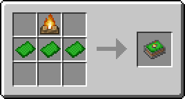
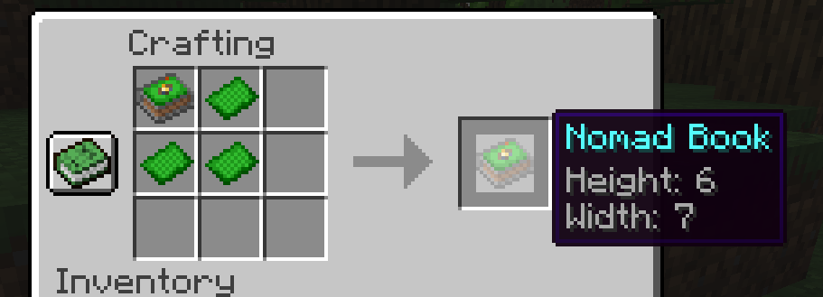
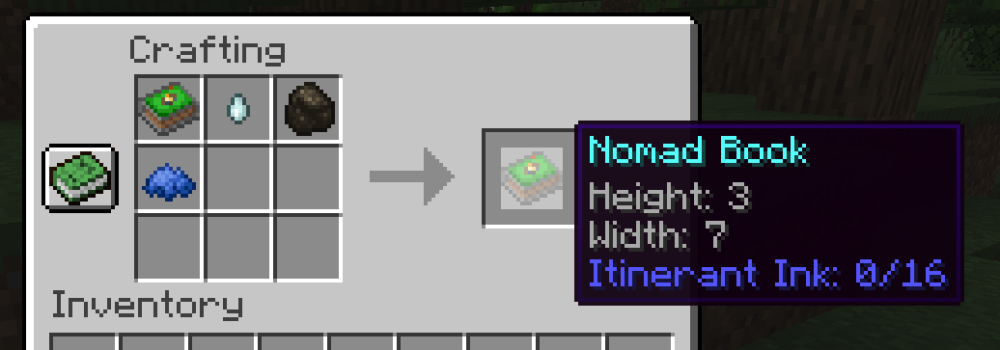
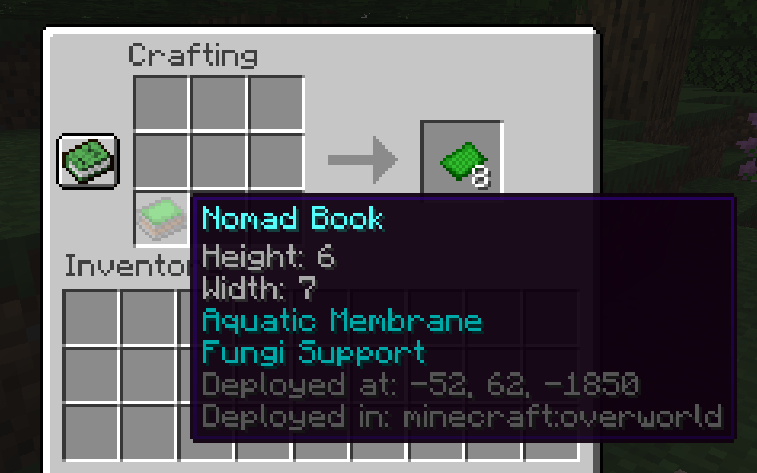
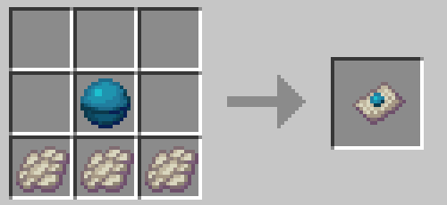
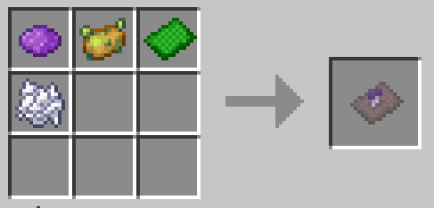
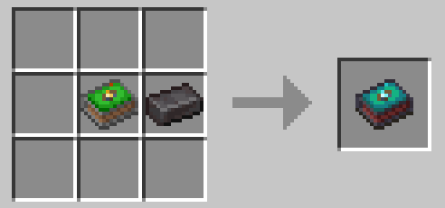

# Nomad Books

**Nomad Books** is a Minecraft Fabric mod that introduces a solution for players that are always adventuring around their world. Nomad books and pages allow these players to store their camp under the form of an item and redeploy it whenever and wherever they wish.

# Items

## Grass Page

Blades of grass magically and carefully weaved into a delicate page. Crafting and upgrade material for nomad books and nomad pages.

#### Obtaining

Grass pages have a 50% chance to be found in any dungeon, mineshaft, jungle temple chests and cartographer chests in stacks of 1. Grass pages can also be obtained from nomad books by dismantling them.

## Nomad Books

A **nomad book** is an item that can store a WxHxW sized camp, with W the width and H the height. When the camp is stored in the book, the cover of the book displays a campfire. When the camp is deployed, the cover does not display said campfire.

#### Obtaining

Nomad books can be obtained by combining a campfire and grass pages. A newly crafted nomad book will have a height of 1 and a width of 3.

Nomad books of 1 in height and 3 in width can also be found with a 50% chance in all stronghold libraries chests in stacks of 1.

#### Usage

When a nomad book has a camp stored inside it, using it on a block with the book will deploy the camp. To deploy the camp, the surface needs to be wide enough and the area needs to be free of non-replaceable blocks (the camp will automatically destroy grass and snow when deployed).

When a nomad book does not store a camp (meaning the camp is deployed), using it will retrieve the camp. However, camps cannot be retrieved across dimensions. Alternatively, using it while sneaking will reveal the camp's boundaries (blocks highlighted being included).

#### Upgrading

##### Height

A book's height can be upgraded by shapelessly combining it with grass pages in a crafting inventory. The camp has to be undeployed in order for the player to be able to upgrade the book.

##### Width

A book's width can be upgraded by using itinerant ink. Itinerant ink can be applied to a book by shapelessly combining it with a ghast tear, blue dye and charcoal.

Upon application, a goal will be decided depending on the current width size. Progress towards this goal needs to be made by exploring and going through different biomes. Upon reaching the goal, the book will gain 2 in width.

#### Dismantling

Nomad books and pages can be dismantled into grass pages. To do so, they need their camp to be deployed and be placed into a crafting inventory. Dismantling will give three grass pages plus one page per height above 1, one page per 2 width above 3, and one page for each special page applied.

#### Teleporting

If a nomad book is deployed and you are too far to retrieve the camp, holding ender pearls in your offhand will allow you to teleport to it for the price of an ender pearl for every 60 blocks separating you from your camp.

## Special pages and upgrades

**Special pages** are unique pages that trigger very specific effects upon camp deployment when combined with a nomad book.

### Aquatic Membrane Page

The **aquatic membrane page** is a special page granting the **Aquatic Membrane** upgrade. **Aquatic membrane** allows the camp to be deployed underwater protected by a membrane. Any entity can freely go through membrane blocks but fluids will be blocked.

#### Obtaining

Aquatic membrane pages can be crafted by combining 3 phantom membranes and a heart of the sea.

### Mycelium Page

The **mycelium page** is a special page granting the **Fungi Support** upgrade. **Fungi support** allows the camp to be deployed on unstable surfaces, as long as nothing is in the way, by growing a special mushroom.

#### Obtaining

Mycelium pages can be crafted by shapelessly combining purple dye, a poisonous potato, bone meal and a grass page.

### Nether Nomad Book

The **nether nomad book** is an upgrade similar to all netherite items: for the cost of one netherite ingot, the dropped nomad book item is rendered fireproof and will float upwards if it were to fall into lava (when crafting a nether nomad book all properties are preserved).

